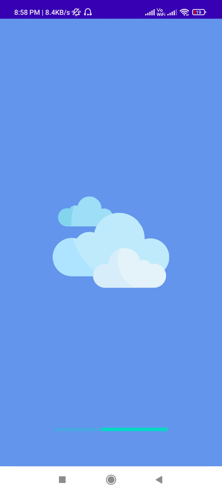

# Weather Update
> Weather Forecast Application for Android.  

 

  

 

## Screenshot 

## Features

Weather Update provides current atmospheric pressure, weather condition, visibility distance, relative humidity, precipitation in different unites, dew point, wind speed with just a single click.

Weather app has a lot of features:
- Free.
- It's VERY FAST and ACCURATE
- Modern UI design and easy to use

## Tech Stack

- **Programming Language:** Kotlin 
- **Software:** Android Studio
- **Weather Data Source:** OpenWeatherMap API 
- **Dependencies:** NIL

## Created By
Auther: [**Sumit Kumar**](https://github.com/thesumitkumar)

## Contribution
Your ideas, translations, design changes, code cleaning, or real heavy code changes or any help is always welcome. The more is contribution the better it gets

[Pull requests](https://github.com/thesumitkumar/weather-app/pulls) will be reviewed
<!--
#### Known issues and limitations
-->